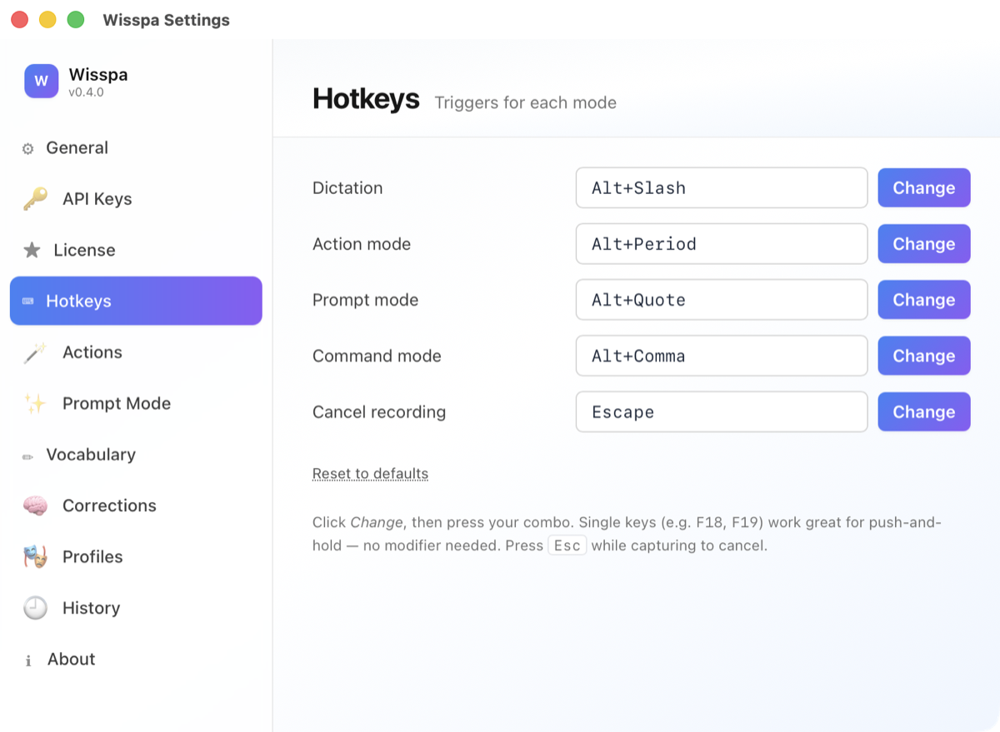
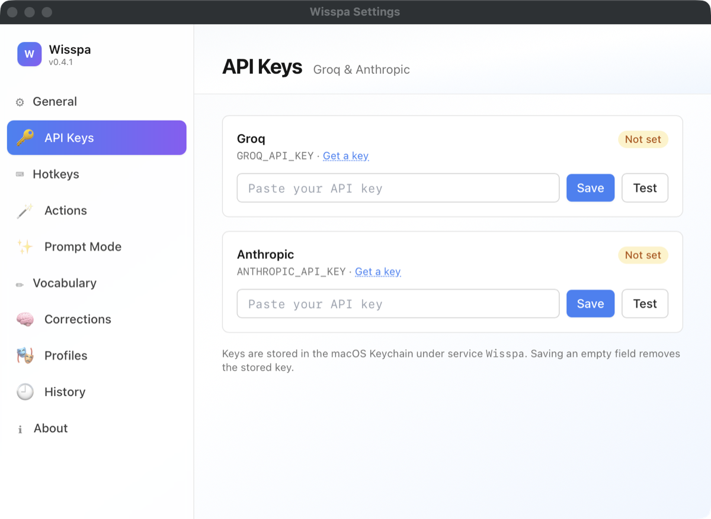

# Wisspa

> Everyone's using AI. Almost nobody knows how to prompt it.
> Wisspa fixes that — with your voice.

**Hold a key, say the messy version, and Wisspa writes the prompt the AI actually wants** — then types it into whatever app you're in. It also dictates, rewrites selections, and runs voice commands. Free and open source under the [MIT License](LICENSE).

[](LICENSE)
[](https://github.com/TechGuiderBB/wisspa/actions/workflows/security.yml)
[](https://www.wisspa.app)
[](https://www.wisspa.app)

---

## The core idea: voice → genuinely good prompt

Voice-to-text is solved. **Voice-to-good-prompt is not** — and prompting is the part of using AI that most people were never taught. That's the gap Wisspa was built for.

You don't compose anything. You hold `⌘⇧P` and ramble:

> *"this function is slow, can you look at why and maybe make it faster but don't change what it returns"*

Wisspa notices you're in Cursor and types:

```
Refactor processBatch() for performance.
Constraints: identical return values; no API changes.
Show the bottleneck before and after.
```

Same voice, one app later — claude.ai this time:

```xml
<task>Refactor processBatch() for performance.</task>
<constraints>Identical return values. No API changes.</constraints>
<output>Show the bottleneck, then the fix.</output>
```

Claude gets XML tags. ChatGPT gets Markdown headings. Cursor gets the terse inline form. Gemini gets numbered steps. **And if you're not in an AI tool at all** — Gmail, Notion, LinkedIn — it skips "prompt" and just writes the email/post/doc for you. It reads the active browser tab to tell the difference.

Under the hood it's Claude Sonnet doing the rewrite (with an optional second critique-and-revise pass for complex asks), your transcript explicitly fenced as *content, not instructions* — so mumbling into the mic never becomes a fabricated task, and a malicious web page can't smuggle instructions into your prompt.

## …and the other three hotkeys

| Mode | Default | What happens |
|---|---|---|
| **Prompt** ✨ | `⌘⇧P` | The one above. The reason this repo exists. |
| **Dictation** | `⌘⇧Space` | Speech → Whisper → cleanup → text at your cursor. Filler removed, punctuation added, tone matched to the app: polished in Gmail, casual in Slack, `backticks` in your editor. |
| **Command** | `⌘⇧C` | Select text, speak an instruction ("make this formal", "translate to French") — the selection is rewritten in place. |
| **Action** | `⌘⇧A` | "Take a screenshot", "lock my screen", "search GitHub for wisspa". 14 voice actions ship as editable YAML; add your own in seconds, hot-reload, no restart. |
| **Cancel** | `Esc` | Abort mid-recording. No API call, no charge. |

A small "Wisspa" pill lives at the top of your screen and flashes red while recording — that's the whole interface until you need settings:

<p align="center">
  
</p>

Every hotkey is reassignable — during onboarding or any time in Settings. Single keys like `F18` make great one-finger triggers.

<p align="center">
  
</p>

Settings is eleven tabs of actual controls — hotkeys, per-app profiles, vocabulary, corrections, history — not a config file in disguise:

<p align="center">
  
</p>

## Get it

**Download:** [wisspa.app/download](https://www.wisspa.app/download) — signed, notarised builds with automatic in-app updates, free forever. Or grab the same build from [Releases](https://github.com/TechGuiderBB/wisspa/releases) / build from source. Same app every way.

**Requirements:** macOS 13+, Apple Silicon, and your own [Groq](https://console.groq.com/keys) (speech-to-text) and [Anthropic](https://console.anthropic.com/settings/keys) (cleanup + prompts) API keys — both have free tiers. Keys live in your macOS Keychain, never in files, never near a server of ours.

**From source:**

```bash
git clone https://github.com/TechGuiderBB/wisspa.git
cd wisspa
pnpm install
pnpm tauri dev        # or: pnpm tauri build
```

First launch runs an 8-step onboarding: the four macOS permissions (each explained, each skippable-but-consequential), your API keys (tested on the spot), hotkey setup, and a mic calibration + test dictation so you *know* it works before you rely on it.

**Docs:** [wisspa.app/docs](https://www.wisspa.app/docs) — install, permissions, hotkeys, settings, the action YAML schema, troubleshooting.

## Why it's built the way it is

- **Local-first, on principle.** No backend, no account, no telemetry, no analytics SDK. Network egress is exactly three calls — Groq, Anthropic, an optional update check — all with *your* keys. Audio is buffered only while you hold the key and discarded after transcription. We couldn't see what you say to it if we wanted to.
- **App-aware.** Wisspa snapshots the frontmost app (and browser tab) at the moment you press, and everything downstream adapts: dictation tone, prompt format, whether you even get a prompt.
- **Actions are just files.** One YAML file per voice command in `~/Library/Application Support/com.techguider.wisspa/actions/`, file-watched and hot-reloaded. Shell commands are validated at load — `sudo`, `rm -rf`, `dd`, and piped `curl`/`wget` are rejected. Voice-activated `rm -rf /` is a genre of disaster we'd rather not enable.
- **Boring reliability, engineered.** One retry on transient API failures. Prompt mode falls back to your raw words rather than losing them. Clipboard (images included) restored after every paste. Silence gating uses Whisper's own confidence scores, so quiet speakers aren't thrown away. Every press is timed and logged to local history — the History tab shows you real latency, not marketing numbers.

## The stack

Tauri 2 · Rust (hotkeys, STT, LLM, injector, action registry) · React 18 + Vite + TypeScript · Tailwind · Groq `whisper-large-v3-turbo` · Anthropic Haiku (cleanup, command) + Sonnet (prompt rewrite) · SQLite history · macOS Keychain · AppleScript via System Events.

~250 automated tests (`cargo test`), CI on every PR: tests, typecheck, gitleaks, cargo audit, pnpm audit, semgrep. See [CHANGELOG.md](CHANGELOG.md) for what's shipped and [CONTRIBUTING.md](CONTRIBUTING.md) if you'd like to help.

## License

[MIT](LICENSE). Copyright © 2026 TechGuider. Use it, fork it, ship it — attribution is the whole ask. If it saves you time, the best thanks are a star, a bug report, or telling one person.

---

*Built by [TechGuider](https://www.wisspa.app) in Sydney. Yes, the README was dictated.*
